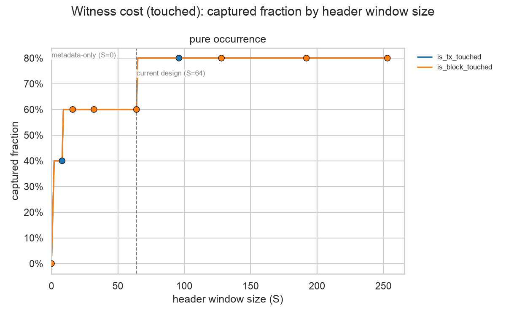
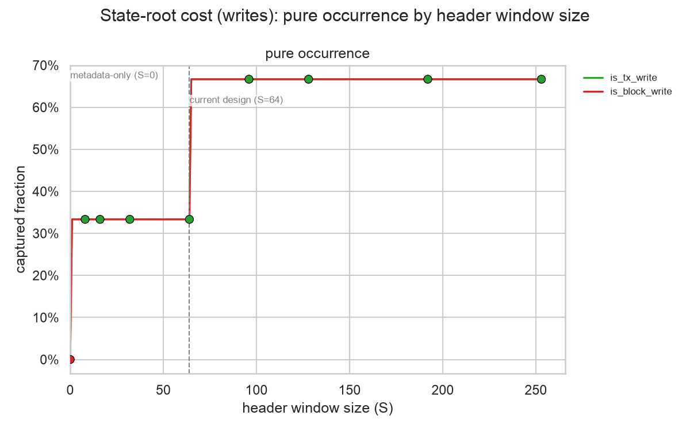
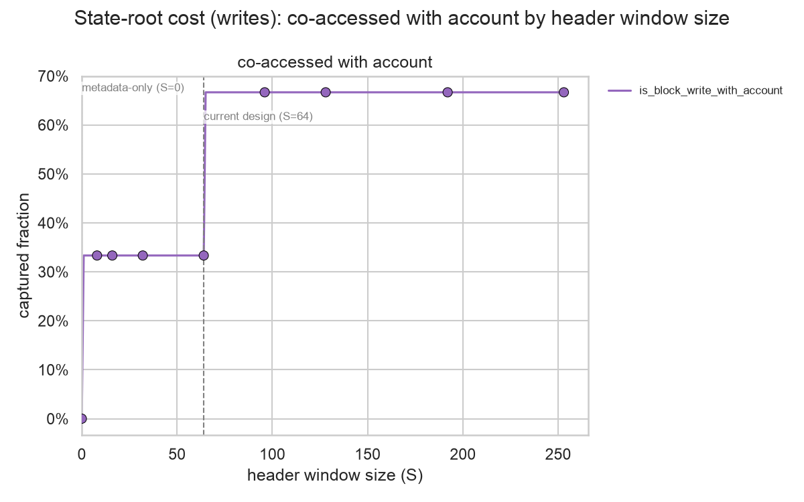
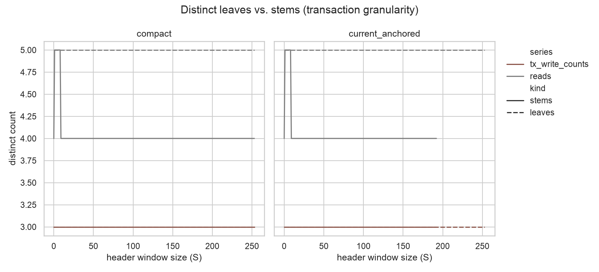
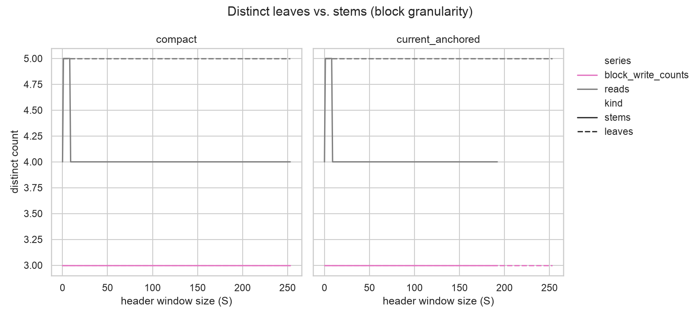

# Part 1: Storage-Window Locality and Stem Replay

## Methodology summary

Part 1 sweeps the header storage window `S` from 0 to 253 with `C=0`, emphasizing `S in {0, 8, 16, 32, 64, 96, 128, 192, 253}`. `S=0` is the metadata-only baseline and `S=64` matches the current `HEADER_STORAGE_SLOTS` design. For each `S`, a storage slot `x` is in the header if `x < S`. Two suffix placements are evaluated: compact (`suffix = 3 + x`, valid for every `S`) and current-anchored (`suffix = 64 + x`, valid only up to `S=192`, matching the live layout exactly at `S=64`). This report tracks two cost dimensions, each an occurrence count (one row per distinct key touched, never weighted by how many times it was touched -- see the Limitations section for why): witness/proof cost for every touch (`is_tx_touched*` / `is_block_touched*`) and state-root rehash cost for writes (`is_tx_write` / `is_block_write`). All counts in this report are Tier 1: exact event, distinct-leaf, and distinct-stem counts from canonical access data. Tier 2 metrics (proof siblings, witness bytes, recomputed hashes) require a pinned PBT implementation and pre-state and are out of scope for this deliverable.

### Event series summary

Two access kinds are tracked per scope: `*_touched` (every key touched at all, whether or not it was also net-changed) and `*_write` (a key net-changed). Touched is a superset of write, not disjoint from it: a write-coupled key is counted in both, since it needs a witness/proof and a rehash on the same event. Touched models witness/proof cost; write models state-root rehash cost. Each kind is measured at two grains: `is_tx_*` counts distinct (block, transaction, address, slot) keys, `is_block_*` counts distinct (block, address, slot) keys net across the whole block.

Every series except `is_tx_write` also has a `_with_account` counterpart: the same population, restricted to touches whose account was also independently `BASIC_DATA`-accessed or mutated in the same scope -- the only touches where sharing the header stem can actually save a proof lookup or a rehash. `is_tx_write` has no such variant because only block-final balance/nonce mutations are extracted, not per-transaction ones (see Limitations). On the touched side the restriction never removes anything -- every storage access already requires resolving the account's own header fields -- so `_with_account` touched series are identical to their pure counterpart and are omitted below (see Witness cost (touched)); `is_block_write` and `is_block_write_with_account` share a denominator by construction and are merged into one row.

The table below gives each series' total, the denominator behind every captured-fraction figure in this report.

| Series | Total events |
| --- | --- |
| `is_tx_touched` | 5 |
| `is_block_touched` | 5 |
| `is_tx_write` | 3 |
| `is_block_write` / `is_block_write_with_account` | 3 |

## Witness cost (touched)

This section estimates witness/proof-cost savings from growing the header storage window `S`: how large a share of all storage touches -- read-only or later net-changed -- could be proved from the account's already-shared header stem instead of an independent one, at each window size. A witness has to prove a key's pre-state value regardless of whether it then gets written, so this section deliberately covers every touch. It addresses the core sizing question -- how much locality benefit each additional header slot buys -- separately for touches counted per transaction and per block. `is_tx_touched` and `is_block_touched` include any key that was also net-changed in that scope (see Event series summary), so a write-coupled key contributes to both this section and State-root cost (writes) -- intentionally, since it incurs both costs on the same event.

The plot shows the captured fraction of each touched occurrence series as `S` grows, one line per series; markers highlight the emphasized `S` values, and the vertical lines mark the metadata-only (`S=0`) and current (`S=64`) designs.

The table gives the same captured fraction at the metadata-only, current, and largest swept window sizes, for reference.

| Series | S=0 | S=64 | S=253 |
| --- | --- | --- | --- |
| is_tx_touched | 0.0% | 60.0% | 80.0% |
| is_block_touched | 0.0% | 60.0% | 80.0% |

Every touched series' `_with_account` counterpart (restricted to touches whose account was also independently `BASIC_DATA`-accessed) is numerically identical to the pure occurrence series shown here, at every `S` -- see the `read` row of the BASIC_DATA co-location table in State-root cost (writes), which is 100% throughout. This report therefore omits `_with_account` touched series. See Limitations for a caveat on what "touched" means given how the underlying data is collected.

## State-root cost (writes)

This section estimates state-root rehash savings from growing `S`: how large a share of write-side storage mutations could share a stem rehash with the account's own header fields, at each window size. Unlike reads, whether a mutation's account was independently `BASIC_DATA`-mutated in the same block matters here, so pure occurrence and account-co-accessed captured fractions are shown as two separate plots.

The first plot is the raw net-mutation occurrence curve: every distinct key net-changed, regardless of whether its account was independently mutated.

The second plot restricts the numerator to keys whose account was also `BASIC_DATA`-mutated in the same block, over the *same* denominator -- the only mutations where sharing the header stem actually saves a rehash, since the stem needs rehashing either way once something else inside it changed. `is_tx_write` has no such counterpart (see Limitations).

The table gives the captured fraction of both curves at the metadata-only, current, and largest swept window sizes, for reference.

| Series | S=0 | S=64 | S=253 |
| --- | --- | --- | --- |
| is_tx_write | 0.0% | 33.3% | 66.7% |
| is_block_write | 0.0% | 33.3% | 66.7% |
| is_block_write_with_account | 0.0% | 33.3% | 66.7% |

The table below shows how often a low-index storage touch shares an account header stem with an independently observed `BASIC_DATA` access or mutation, by `S`. The `read` row is the basis for the touched-side note in Witness cost (touched): it is 100%, confirming that every storage touch's account is independently accessed. The `write` row is far lower, which is why the co-accessed curve above differs materially from the pure occurrence curve. This is an observed-metadata lower bound: it excludes code-hash resolution and other implied header reads.

| Series | S=0 | S=64 | S=253 |
| --- | --- | --- | --- |
| read | n/a | 80.0% | 85.7% |
| write | n/a | 100.0% | 100.0% |

## Distinct leaf and stem replay

This section checks distinct-key replay: whether shrinking the number of distinct stems that need proving or rehashing (by moving slots into a shared header stem) reduces work independently of the occurrence curves above. Distinct leaf counts are invariant to `S` by construction -- moving a slot into the header changes its key, not whether it was touched -- while distinct stem counts fall as `S` grows, because more slots collapse into shared header stems. Both suffix placements (compact, current-anchored) are shown; current-anchored is only defined up to `S=192`.

The first plot is per-transaction distinct leaf and stem counts, faceted by placement.

The second plot is the same, per block.

## Limitations

1. This report reflects backward-looking mainnet behavior shaped by MPT-era gas costs; it describes how well the current window serves current behavior, not how contracts would relayout under PBT's own repricing.
2. The read channel estimates proof and witness work. Stateful clients may serve ordinary execution reads from flat state, so these curves should not be read as a claim about flat-state lookup latency.
3. Only Tier 1 metrics are reported. Exact proof siblings, witness bytes, and recomputed hashes require a pinned PBT implementation and pre-state and remain deferred.
4. The sampled block range skews toward whatever contracts were active during it and should not be read as representative of all Ethereum contracts.
5. The `BASIC_DATA` co-location proxy is an observed lower bound built from balance and nonce reads and diffs; it excludes code-hash resolution and other implied header reads.
6. All event_locality series are occurrence counts, not weighted by how many times a key was touched: witness cost is paid once per distinct key a block's execution needs proved, and state-root rehash cost is paid once per distinct key net-changed, in each case regardless of raw touch multiplicity (further, even EVM gas accounting already dedupes to first-touch-per-transaction via EIP-2929 warm/cold pricing).
7. `is_tx_write` has no `_with_account` counterpart: only block-final balance/nonce mutations are extracted (no per-transaction table), so per-transaction account co-mutation can't be checked without overstating it via the block-level proxy.
8. `canonical_execution_storage_reads` is collected via geth's prestate tracer (through cryo), which fires its SLOAD/SSTORE hook for both opcodes identically -- there is no field distinguishing which opcode produced a row. This doesn't affect `is_tx_touched` / `is_block_touched` themselves, which count every touch regardless of which opcode produced it; it only means these series can't be split into "real `SLOAD`s" versus SSTORE-implied pre-reads, since the data doesn't separate them. `is_tx_write` / `is_block_write` are unaffected: they come from a separate state-diff trace and only include keys with a genuine value change.

## Data quality and reconciliation

| Check | Result |
| --- | --- |
| rejected_counts | storage_reads={'address_rejected': 0, 'slot_rejected': 0}; storage_tx_mutations={'address_rejected': 0, 'slot_rejected': 0}; storage_block_mutations={'address_rejected': 0, 'slot_rejected': 0}; balance_reads={'address_rejected': 0}; nonce_reads={'address_rejected': 0}; balance_block_mutations={'address_rejected': 0}; nonce_block_mutations={'address_rejected': 0} |
| read_partition_check | n_reads=5; n_tx_read=2; n_tx_read_write=3; partition_holds=True |
| block_read_partition_check | n_block_reads=5; n_block_read=2; n_block_read_write=3; partition_holds=True |
| read_count_weighted_partition_check | total_read_count=11.0; split_read_count=11.0; partition_holds=True |
| storage_tx_mutations_key_unique | True |
| storage_block_mutations_key_unique | True |
| tx_write_keys_all_observed_as_reads | n_tx_write_keys=3; n_uncovered=0; holds=True |
| block_write_keys_all_observed_as_reads | n_block_write_keys=3; n_uncovered=0; holds=True |
