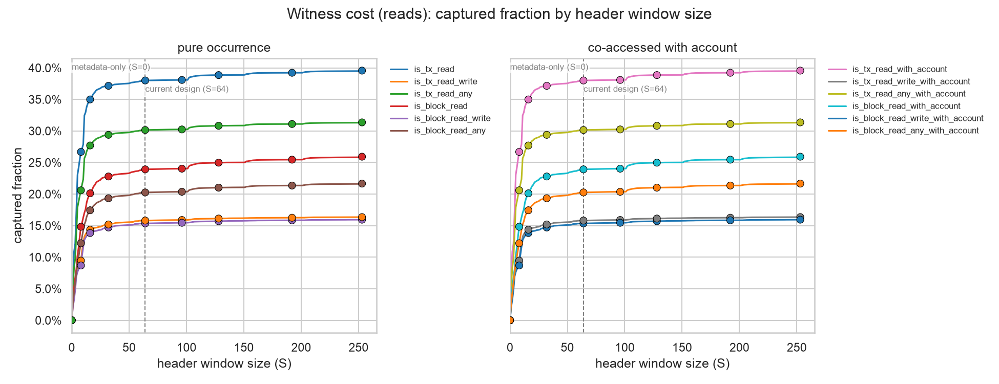
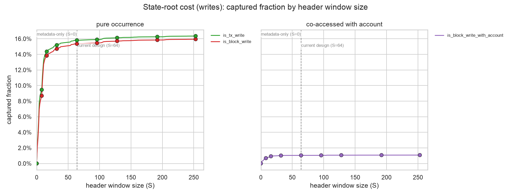
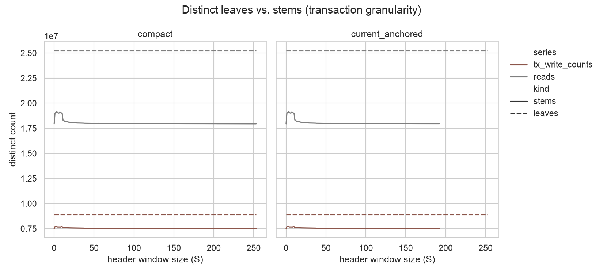
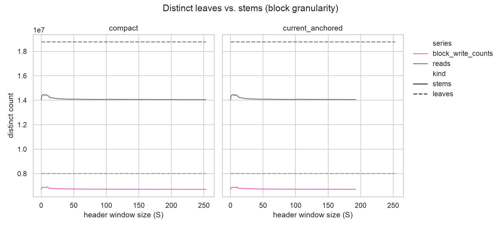
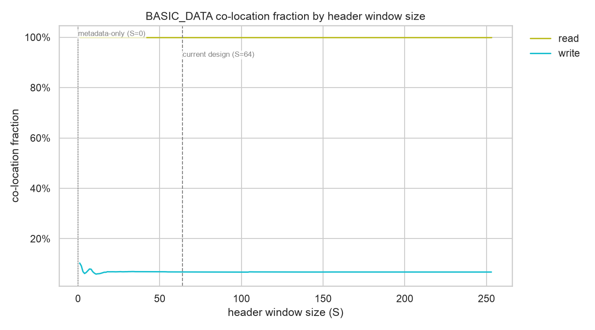
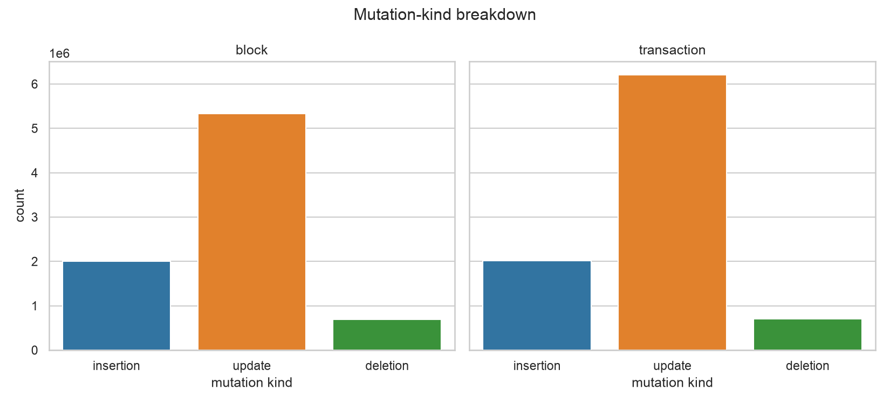

# Part 1: Storage-Window Locality and Stem Replay

## Methodology summary

Part 1 sweeps the header storage window `S` from 0 to 253 with `C=0`, emphasizing `S in {0, 8, 16, 32, 64, 96, 128, 192, 253}`. `S=0` is the metadata-only baseline and `S=64` matches the current `HEADER_STORAGE_SLOTS` design. For each `S`, a storage slot `x` is in the header if `x < S`. Two suffix placements are evaluated: compact (`suffix = 3 + x`, valid for every `S`) and current-anchored (`suffix = 64 + x`, valid only up to `S=192`, matching the live layout exactly at `S=64`). This report tracks two cost dimensions, each an occurrence count (one row per distinct key touched, never weighted by how many times it was touched -- see the Limitations section for why): witness/proof cost for reads (`is_tx_read*` / `is_block_read*`) and state-root rehash cost for writes (`is_tx_write` / `is_block_write`). Each series has a `_with_account` counterpart sharing the same denominator, restricted to touches whose account was also BASIC_DATA-accessed in the same scope -- the header window's stem-sharing only pays off when a slot's stem would otherwise need touching anyway for the account's own header fields. All counts in this report are Tier 1: exact event, distinct-leaf, and distinct-stem counts from canonical access data. Tier 2 metrics (proof siblings, witness bytes, recomputed hashes) require a pinned PBT implementation and pre-state and are out of scope for this deliverable.

### Event series summary

Total event count per series, independent of `S` (the denominator behind every captured-fraction figure below).

| Series | Description | Total events |
| --- | --- | --- |
| is_tx_read | Distinct (block, transaction, address, slot) keys read but never written in that transaction: one row per occurrence, regardless of how many times the slot was read. | 16,333,897 |
| is_tx_read_write | Distinct (block, transaction, address, slot) keys read and also written (net-changed) in that same transaction: one row per occurrence, regardless of how many times the slot was read. | 8,929,303 |
| is_tx_read_any | Distinct (block, transaction, address, slot) keys read in that transaction, whether or not they were also written: the union of `is_tx_read` and `is_tx_read_write`. | 25,263,200 |
| is_block_read | Distinct (block, address, slot) keys read by at least one transaction in the block but never net-changed in that block. | 10,766,329 |
| is_block_read_write | Distinct (block, address, slot) keys read by at least one transaction in the block and also net-changed in that block. | 8,016,205 |
| is_block_read_any | Distinct (block, address, slot) keys read by at least one transaction in the block, whether or not they were also net-changed: the union of `is_block_read` and `is_block_read_write`. | 18,782,534 |
| is_tx_read_with_account | `is_tx_read` restricted to keys whose account also had an observed balance/nonce read in the same transaction (the BASIC_DATA read proxy) -- the only touches where sharing the account's header stem can actually save a witness lookup. Same denominator as `is_tx_read`. | 16,333,897 |
| is_tx_read_write_with_account | `is_tx_read_write` restricted the same way: keys whose account also had an observed balance/nonce read in the same transaction. Same denominator as `is_tx_read_write`. | 8,929,303 |
| is_tx_read_any_with_account | `is_tx_read_any` restricted the same way: keys whose account also had an observed balance/nonce read in the same transaction. Same denominator as `is_tx_read_any`. | 25,263,200 |
| is_block_read_with_account | `is_block_read` restricted to keys whose account also had an observed balance/nonce read anywhere in the block. Same denominator as `is_block_read`. | 10,766,329 |
| is_block_read_write_with_account | `is_block_read_write` restricted the same way: keys whose account also had an observed balance/nonce read anywhere in the block. Same denominator as `is_block_read_write`. | 8,016,205 |
| is_block_read_any_with_account | `is_block_read_any` restricted the same way: keys whose account also had an observed balance/nonce read anywhere in the block. Same denominator as `is_block_read_any`. | 18,782,534 |
| is_tx_write | Per-transaction storage mutations: one row per (block, transaction, address, slot) whose value changed within that transaction (no-ops already excluded). | 8,929,303 |
| is_block_write | Block-final net storage mutations: one row per (block, address, slot) whose value changed net across the whole block (no-ops already excluded). | 8,016,205 |
| is_block_write_with_account | `is_block_write` restricted to keys whose account also had an observed balance/nonce mutation in the same block (the BASIC_DATA mutation proxy) -- the only touches where sharing the account's header stem can actually save a state-root rehash. Same denominator as `is_block_write`. `is_tx_write` has no such counterpart: no per-transaction balance/nonce mutation table is extracted, so per-transaction co-mutation can't be checked without overstating it via this block-level proxy. | 8,016,205 |

## Witness cost (reads)

Captured fraction of each read-side occurrence series for a header window of size `S`. The left panel is the raw occurrence curve (every distinct key touched, transaction- or block-grain); the right panel restricts the numerator to touches whose account was also BASIC_DATA-accessed in the same scope, over the *same* denominator -- the only touches where being inside the header window can actually shrink a witness, since a slot's stem needs proving either way once something else in it is independently needed.

| Series | S=0 | S=64 | S=253 |
| --- | --- | --- | --- |
| is_tx_read | 0.0% | 38.0% | 39.6% |
| is_tx_read_write | 0.0% | 15.8% | 16.3% |
| is_tx_read_any | 0.0% | 30.2% | 31.4% |
| is_block_read | 0.0% | 23.9% | 25.9% |
| is_block_read_write | 0.0% | 15.3% | 15.9% |
| is_block_read_any | 0.0% | 20.3% | 21.7% |
| is_tx_read_with_account | 0.0% | 38.0% | 39.6% |
| is_tx_read_write_with_account | 0.0% | 15.8% | 16.3% |
| is_tx_read_any_with_account | 0.0% | 30.2% | 31.4% |
| is_block_read_with_account | 0.0% | 23.9% | 25.9% |
| is_block_read_write_with_account | 0.0% | 15.3% | 15.9% |
| is_block_read_any_with_account | 0.0% | 20.3% | 21.7% |

## State-root cost (writes)

Captured fraction of each write-side occurrence series for a header window of size `S`. The left panel is the raw net-mutation occurrence curve; the right panel restricts the numerator to keys whose account was also BASIC_DATA-mutated in the same block, over the *same* denominator -- the only mutations where sharing the header stem actually saves a rehash, since the stem needs rehashing either way once something else inside it changed. `is_tx_write` has no account-restricted counterpart (see Limitations).

| Series | S=0 | S=64 | S=253 |
| --- | --- | --- | --- |
| is_tx_write | 0.0% | 15.8% | 16.3% |
| is_block_write | 0.0% | 15.3% | 15.9% |
| is_block_write_with_account | 0.0% | 1.0% | 1.1% |

## Distinct leaf and stem replay

Distinct leaf counts are invariant to `S`: moving a slot into the header changes its key, not whether it was touched. Distinct stem counts fall as `S` grows, because more slots collapse into shared header stems. Both placements (compact, current-anchored) are shown; current-anchored is only defined up to `S=192`.

## BASIC_DATA co-location

How often a low-index storage access shares an account header stem with an observed `BASIC_DATA` access or mutation. This is an observed-metadata lower bound: it excludes code-hash resolution and other implied header reads.

| Series | S=0 | S=64 | S=253 |
| --- | --- | --- | --- |
| read | n/a | 100.0% | 100.0% |
| write | n/a | 6.8% | 6.8% |

## Mutation-kind diagnostics

Zero-to-nonzero (insertion), nonzero-to-nonzero (update), and nonzero-to-zero (deletion) mutations, counted separately. Their union is the net-mutation denominator used elsewhere in this report.

| Kind | Block-final count | Transaction-sensitivity count |
| --- | --- | --- |
| insertion | 1,997,814 | 2,014,855 |
| update | 5,326,171 | 6,205,187 |
| deletion | 692,220 | 709,261 |

## Comparison against S=0 and current S=64

The gain column is the captured-fraction increase the current 64-slot window buys over the metadata-only baseline, for each event-locality series.

| Series | Metadata-only (S=0) | Current (S=64) | Gain |
| --- | --- | --- | --- |
| is_tx_read | 0.0% | 38.0% | 38.0% |
| is_tx_read_write | 0.0% | 15.8% | 15.8% |
| is_tx_read_any | 0.0% | 30.2% | 30.2% |
| is_block_read | 0.0% | 23.9% | 23.9% |
| is_block_read_write | 0.0% | 15.3% | 15.3% |
| is_block_read_any | 0.0% | 20.3% | 20.3% |
| is_tx_read_with_account | 0.0% | 38.0% | 38.0% |
| is_tx_read_write_with_account | 0.0% | 15.8% | 15.8% |
| is_tx_read_any_with_account | 0.0% | 30.2% | 30.2% |
| is_block_read_with_account | 0.0% | 23.9% | 23.9% |
| is_block_read_write_with_account | 0.0% | 15.3% | 15.3% |
| is_block_read_any_with_account | 0.0% | 20.3% | 20.3% |
| is_tx_write | 0.0% | 15.8% | 15.8% |
| is_block_write | 0.0% | 15.3% | 15.3% |
| is_block_write_with_account | 0.0% | 1.0% | 1.0% |

## Limitations

1. This report reflects backward-looking mainnet behavior shaped by MPT-era gas costs; it describes how well the current window serves current behavior, not how contracts would relayout under PBT's own repricing.
2. The read channel estimates proof and witness work. Stateful clients may serve ordinary execution reads from flat state, so these curves should not be read as a claim about flat-state lookup latency.
3. Only Tier 1 metrics are reported. Exact proof siblings, witness bytes, and recomputed hashes require a pinned PBT implementation and pre-state and remain deferred.
4. The sampled block range skews toward whatever contracts were active during it and should not be read as representative of all Ethereum contracts.
5. The `BASIC_DATA` co-location proxy is an observed lower bound built from balance and nonce reads and diffs; it excludes code-hash resolution and other implied header reads.
6. All event_locality series are occurrence counts, not weighted by how many times a key was touched: witness cost is paid once per distinct key a block's execution needs proved, and state-root rehash cost is paid once per distinct key net-changed, in each case regardless of raw touch multiplicity (further, even EVM gas accounting already dedupes to first-touch-per-transaction via EIP-2929 warm/cold pricing).
7. `is_tx_write` has no `_with_account` counterpart: only block-final balance/nonce mutations are extracted (no per-transaction table), so per-transaction account co-mutation can't be checked without overstating it via the block-level proxy.

## Data quality and reconciliation

| Check | Result |
| --- | --- |
| rejected_counts | storage_reads={'address_rejected': 0, 'slot_rejected': 0}; storage_tx_mutations={'address_rejected': 0, 'slot_rejected': 0}; storage_block_mutations={'address_rejected': 0, 'slot_rejected': 0}; balance_reads={'address_rejected': 0}; nonce_reads={'address_rejected': 0}; balance_block_mutations={'address_rejected': 0}; nonce_block_mutations={'address_rejected': 0} |
| read_partition_check | n_reads=25263200; n_tx_read=16333897; n_tx_read_write=8929303; partition_holds=True |
| block_read_partition_check | n_block_reads=18782534; n_block_read=10766329; n_block_read_write=8016205; partition_holds=True |
| read_count_weighted_partition_check | total_read_count=25263200.0; split_read_count=25263200.0; partition_holds=True |
| storage_tx_mutations_key_unique | True |
| storage_block_mutations_key_unique | True |
